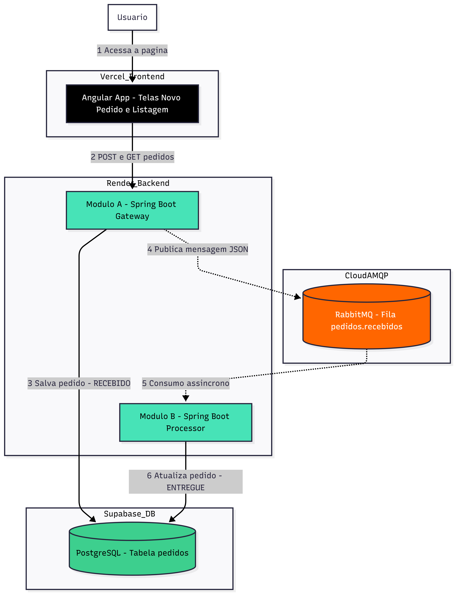

# Desafio Técnico ANBIMA - Estágio de Desenvolvimento (Sistema de Pedidos Distribuído)

Este repositório contém a solução para o desafio técnico de processamento de pedidos de lanche através de strings posicionais.  
O sistema foi desenhado seguindo uma **arquitetura distribuída de microsserviços**, com comunicação assíncrona baseada em filas para garantir **desacoplamento, escalabilidade e resiliência**.

**Desenvolvido por:** Weslley Ribeiro da Silva Felix :D

---

## 1. Visão Geral da Solução

A aplicação simula um sistema real de pedidos de fast food, onde uma string posicional representa um pedido completo.  
Essa string é processada, validada, persistida e posteriormente entregue de forma assíncrona.

O fluxo foi dividido em dois módulos principais:

- **Módulo A (Gateway):** Responsável pela entrada, validação e publicação do pedido.
- **Módulo B (Processor):** Responsável pelo processamento assíncrono e atualização do status.

---

## 2. Links de Produção

O sistema está hospedado em ambiente cloud (PaaS/DBaaS), simulando um cenário real de produção.

-  **Frontend (Vercel):** `https://desafio-tecnico-anbima-ewsg6nmyh-yesleis-projects.vercel.app/pedidos`
- **Módulo A - Gateway (Render):** `https://desafio-tecnico-anbima-1.onrender.com`
- **Módulo B - Processor (Render):** `https://desafio-tecnico-anbima-1.onrender.com`

> **Observação importante (Free Tier):** > Os serviços no Render podem entrar em estado de "sleep" por inatividade.  
> Ao acessar o sistema, utilize o botão **"Ligar Sistema"** e aguarde cerca de **2 minutos** para a inicialização completa dos serviços.

---

## 3. Arquitetura da Solução

Abaixo está o fluxo de dados do sistema, baseado em uma arquitetura orientada a eventos (Event-Driven):




---

## 4. Tecnologias Utilizadas

- **Backend:** Java 21 + Spring Boot 3
- **Frontend:** Angular 20 + TypeScript
- **Banco de Dados:** PostgreSQL (Supabase)
- **Mensageria:** RabbitMQ (CloudAMQP)
- **Infraestrutura:** Docker + Render + Vercel
- **CI/CD:** Github Actions, Render e Vercel.

---

## 5. Pipeline de CI/CD e Fluxo de Deploy

Este projeto adota práticas de DevOps e Git Flow para garantir a integridade do ambiente de produção. O ecossistema foi configurado da seguinte maneira:

-   **Proteção de Branch:** A branch `main` é bloqueada para commits diretos. Qualquer nova alteração no código deve ser submetida obrigatoriamente através de **Pull Requests (PRs)**.
-  **Continuous Integration (CI):** A esteira de CI é orquestrada pelo **GitHub Actions**. Ao abrir um PR, o Actions sobe o ambiente, baixa as dependências e executa a validação de build e os testes. O merge para a `main` só é liberado se todos os *status checks* passarem.
-  **Continuous Deployment (CD):** O deploy contínuo é gerenciado de forma nativa pela **Vercel** (Frontend) e **Render** (Backend). Ambas as plataformas monitoram a branch `main`. Quando um PR é mergeado, elas identificam qual diretório raiz foi alterado e disparam o deploy automaticamente e de forma isolada (evitando builds desnecessários de componentes que não foram modificados).

---
## 6. Disclaimer de Segurança (Importante)

Para fins de facilitação do processo de avaliação, as credenciais de acesso ao banco de dados (Supabase) e ao serviço de mensageria (CloudAMQP) foram mantidas diretamente nos arquivos de configuração (`application.properties`).

### Motivação
Essa decisão foi tomada para permitir que o avaliador consiga:
- Rodar o projeto rapidamente.
- Evitar a configuração manual de dezenas de variáveis de ambiente.

### Em ambiente real de produção
Essas práticas **não são recomendadas**. O correto em um ambiente corporativo seria utilizar:
- Variáveis de ambiente (`ENV`).
- Secret Managers (AWS Secrets Manager, HashiCorp Vault, etc.).

---

## 7. Como Rodar Localmente

### Pré-requisitos
- Java 21
- Maven
- Node.js + Angular CLI

### Executando a Aplicação
No módulo frontend, o serviço `pedido.service.ts` está configurado para importar diretamente o arquivo `environment.prod.ts`. É necessário alterar o caminho para o `environment.ts`.


```bash
# Rodando o Módulo A (Gateway)
cd modulo-a-gateway
mvn spring-boot:run

# Rodando o Módulo B (Processor) - Em outro terminal
cd modulo-b-gateway
mvn spring-boot:run

# Rodando o Frontend - Em outro terminal
cd frontend
npm install
ng serve
